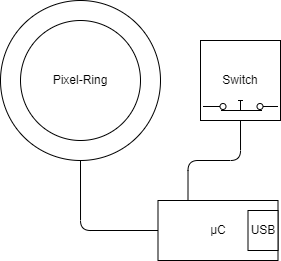

# MagicButton

Awesome button with light-effects for certain events.

## Purpose

This is not meant for everyday use (at least not for me) it is meant to **show off**.
If you are going to conduct presentations where you want to trigger things by hitting a really 
fancy and massive button. This might be useful for you.

As you can see in the video [Magic-Button Demo](https://youtu.be/PIp6pQer74s) it can indicate if a
process was executed successfully or if it failed. You can also see by rotating effect that the 
triggered task is still in process.

## Structure

The button is build from a rugged arcade-button where i replaced the light with a pixel ring.
The following pictures shows the internal structure.

Following parts are used:
- EG STARTS 60 mm Button
- Neo-Pixel-Ring with 16 pixel
- Some wire and hot-glue
- BluePill (STM32F103C8)
- Housing

## Project overview:

The Firmware primarily drives the pixel-ring according to to commands given by host-application (PC).
The connection is implemented in three different ways (for study purpose) and supports. 
- Shell-mode
- API by using printable characters
- API by using binary codes

The Host application connects to the device and reacts to the button events by starting active script
Additionally there is a concept study for a terminal and an evaluation app to checks all functions.
But it mainly consists of a library project that can be integrated in other (useful) applications.

## ToDo

This is by far not final but is already fun to use it during presentations.
Feel free to fork it and adapt it to your own purpose